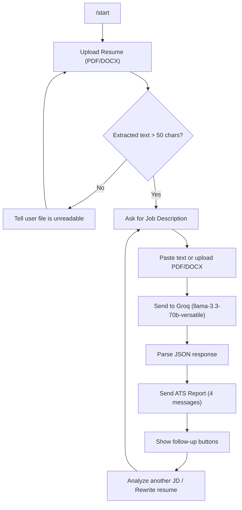

# ResumeBot

A Telegram bot that analyzes resumes against job descriptions using Groq AI and returns an ATS-style compatibility report.

## Workflow



## How It Works

1. **Start** — Send `/start` to begin. The bot asks for your resume.
2. **Upload Resume** — Send a PDF or DOCX file. Text is extracted using `pdfplumber` or `python-docx`. If the file appears unreadable (scanned image), you're asked to try another.
3. **Paste Job Description** — Paste the job description as text or upload a PDF/DOCX.
4. **AI Analysis** — Both texts are sent to Groq's `llama-3.3-70b-versatile` model which returns structured JSON with:
   - ATS score and per-category breakdown (skills, experience, projects, education, keywords, formatting, certifications)
   - Matching skills, missing critical skills, missing nice-to-have skills
   - Strengths, weaknesses, improvement suggestions, learning roadmap
   - Interview readiness estimate
   - Final verdict and match rating
5. **Formatted Report** — The JSON is split into 4 Telegram MarkdownV2 messages with emoji score bands.
6. **Follow-up** — After the report, use inline buttons to analyze another JD or rewrite resume bullet points.

## Setup

```bash
python3 -m venv venv
source venv/bin/activate
pip install -r requirements.txt
cp .env.example .env
# Edit .env with your keys
python main.py
```

## Stack

| Component | Technology |
|---|---|
| Runtime | Python 3.11+ |
| Bot Framework | python-telegram-bot v21+ (async) |
| AI Model | Groq `llama-3.3-70b-versatile` |
| PDF Parsing | pdfplumber |
| DOCX Parsing | python-docx |
| Config | python-dotenv |
| Session | In-memory dict (per chat_id) |

## Project Structure

```
resumebot/
├── main.py           # Entrypoint, builds Application, registers handlers
├── handlers.py       # /start, document upload, text, callback buttons
├── state.py          # In-memory session store
├── file_parser.py    # Extract text from PDF/DOCX
├── analyzer.py       # Calls Groq, returns structured JSON
├── formatter.py      # Formats JSON into Telegram MarkdownV2 messages
├── requirements.txt
├── .env.example
└── README.md
```
